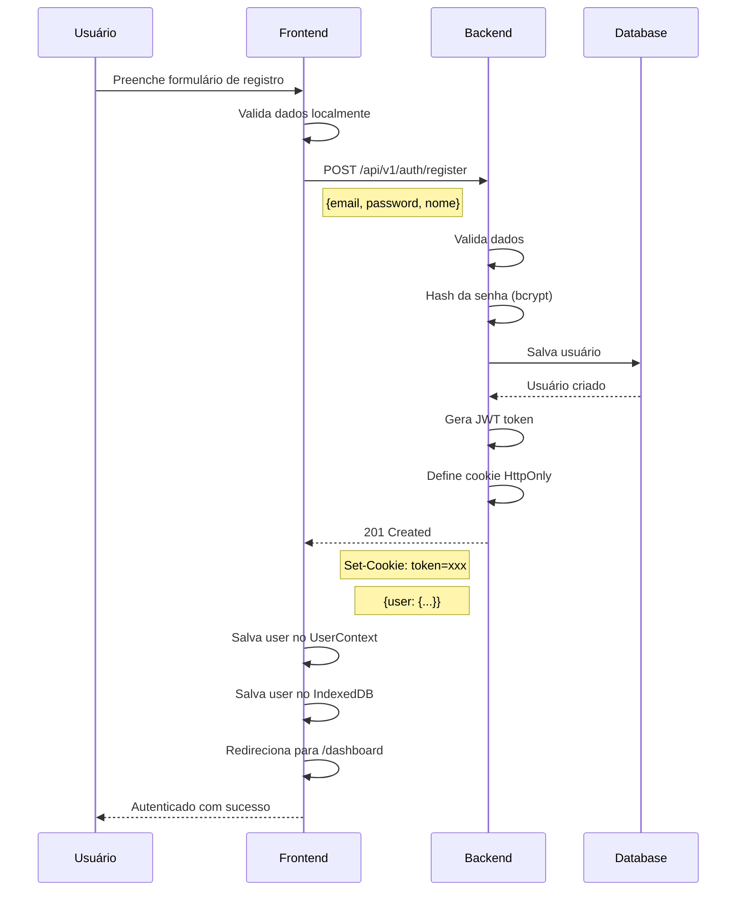
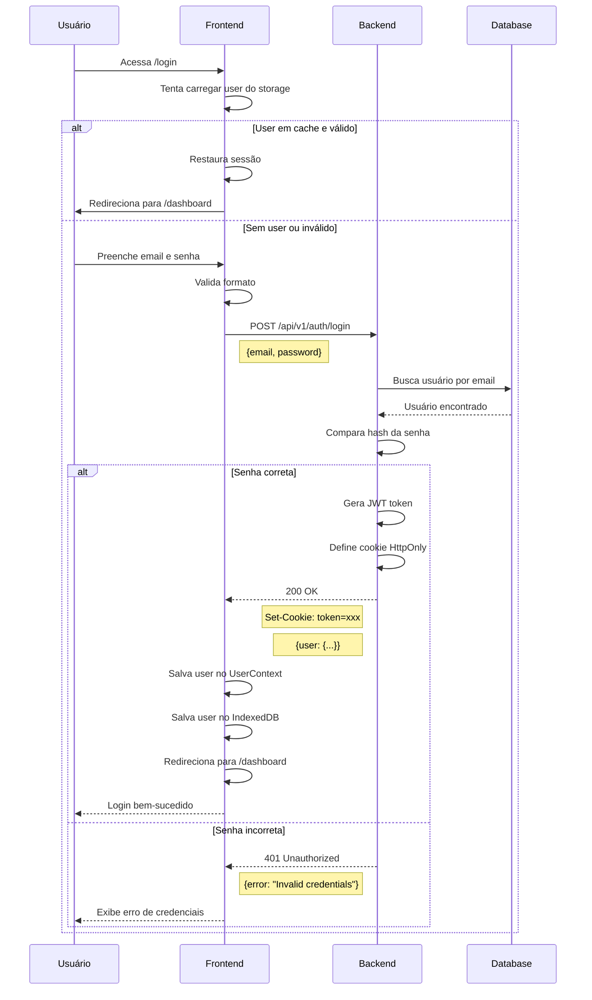
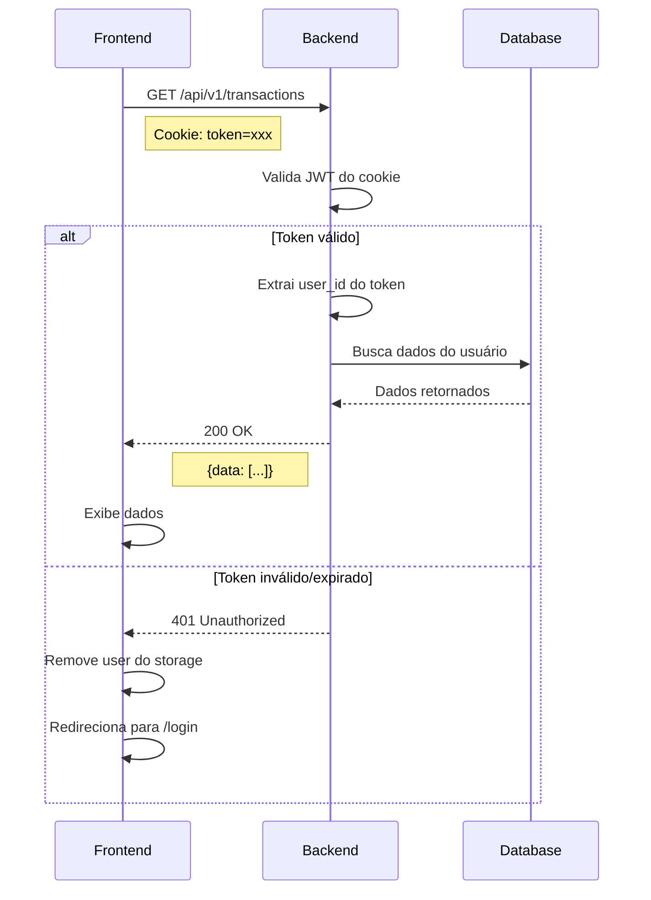
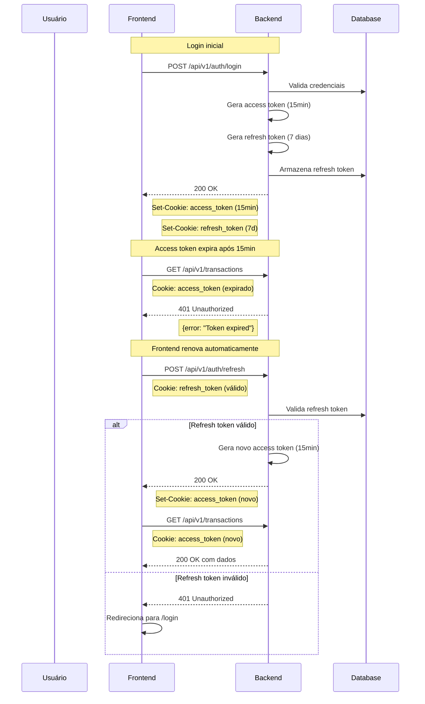

# 🔐 Fluxo de Autenticação - Home Finance

## Visão Geral

Este documento descreve o fluxo completo de autenticação do Home Finance, incluindo registro, login, gerenciamento de sessões e logout.

**Última atualização:** 2025-11-14
**Versão da API:** v1
**Tipo de autenticação:** JWT com HttpOnly Cookies

---

## 📑 Índice

1. [Diagrama de Sequência](#-diagrama-de-sequência)
   - [Fluxo de Registro](#1-fluxo-de-registro)
   - [Fluxo de Login](#2-fluxo-de-login)
   - [Fluxo de Requisições Autenticadas](#3-fluxo-de-requisições-autenticadas)
   - [Fluxo de Logout](#4-fluxo-de-logout)
2. [Formato do Token JWT](#-formato-do-token-jwt)
3. [Endpoints de Autenticação](#-endpoints-de-autenticação)
   - [POST /api/v1/auth/register](#post-apiv1authregister)
   - [POST /api/v1/auth/login](#post-apiv1authlogin)
   - [POST /api/v1/auth/logout](#post-apiv1authlogout)
4. [Segurança](#-segurança)
5. [Guia de Integração para Desenvolvedores](#-guia-de-integração-para-desenvolvedores)
6. [Exemplos de Código](#-exemplos-de-código)
7. [Fluxo de Recuperação de Sessão](#-fluxo-de-recuperação-de-sessão)
8. [Considerações Importantes](#️-considerações-importantes)
9. [Roadmap: Refresh Tokens](#-roadmap-refresh-tokens)
10. [Referências](#-referências)
11. [Troubleshooting](#-troubleshooting)

---

## 📊 Diagrama de Sequência

### 1. Fluxo de Registro



### 2. Fluxo de Login



### 3. Fluxo de Requisições Autenticadas



### 4. Fluxo de Logout

```mermaid
sequenceDiagram
    participant U as Usuário
    participant F as Frontend
    participant B as Backend

    U->>F: Clica em "Sair"
    F->>B: POST /api/v1/auth/logout
    Note right of F: Cookie: token=xxx
    B->>B: Invalida token (se houver lista negra)
    B->>B: Remove cookie HttpOnly
    B-->>F: 200 OK
    Note left of B: Set-Cookie: token=; expires=past
    F->>F: Remove user do UserContext
    F->>F: Remove user do IndexedDB
    F->>F: Limpa cache do React Query
    F->>F: Redireciona para /login
    F-->>U: Logout bem-sucedido
```

---

## 🔑 Formato do Token JWT

### Header
```json
{
  "alg": "HS256",
  "typ": "JWT"
}
```

### Payload
```json
{
  "user_id": 123,
  "email": "usuario@example.com",
  "nome": "João Silva",
  "iat": 1699999999,
  "exp": 1700086399
}
```

### Claims Utilizados

| Claim | Tipo | Descrição |
|-------|------|-----------|
| `user_id` | number | ID único do usuário |
| `email` | string | Email do usuário |
| `nome` | string | Nome completo do usuário |
| `iat` | number | Issued At - timestamp de criação |
| `exp` | number | Expiration - timestamp de expiração |

### Tempo de Expiração
- **Padrão:** 24 horas
- **Refresh:** Não implementado (futura task)

---

## 🌐 Endpoints de Autenticação

### POST /api/v1/auth/register

Cria uma nova conta de usuário.

**Request:**
```json
{
  "email": "usuario@example.com",
  "password": "senha_segura_123",
  "nome": "João Silva"
}
```

**Response (201 Created):**
```json
{
  "code": "USER_CREATED",
  "message": "User created successfully",
  "data": {
    "user": {
      "id": 123,
      "nome": "João Silva",
      "email": "usuario@example.com",
      "created_at": "2025-11-14T10:00:00Z",
      "updated_at": "2025-11-14T10:00:00Z"
    }
  }
}
```

**Headers de Response:**
```
Set-Cookie: token=<jwt_token>; HttpOnly; Secure; SameSite=Strict; Path=/; Max-Age=86400
```

**Validações:**
- Email deve ser válido e único
- Senha deve ter no mínimo 8 caracteres
- Nome é obrigatório

**Errors:**
- `400` - Dados inválidos
- `409` - Email já cadastrado

---

### POST /api/v1/auth/login

Autentica um usuário existente.

**Request:**
```json
{
  "email": "usuario@example.com",
  "password": "senha_segura_123"
}
```

**Response (200 OK):**
```json
{
  "code": "LOGIN_SUCCESS",
  "message": "Login successful",
  "data": {
    "user": {
      "id": 123,
      "nome": "João Silva",
      "email": "usuario@example.com",
      "created_at": "2025-11-14T10:00:00Z",
      "updated_at": "2025-11-14T10:00:00Z"
    }
  }
}
```

**Headers de Response:**
```
Set-Cookie: token=<jwt_token>; HttpOnly; Secure; SameSite=Strict; Path=/; Max-Age=86400
```

**Errors:**
- `400` - Email ou senha faltando
- `401` - Credenciais inválidas
- `404` - Usuário não encontrado

---

### POST /api/v1/auth/logout

Encerra a sessão do usuário.

**Request:**
```
Cookie: token=<jwt_token>
```

**Response (200 OK):
```json
{
  "code": "LOGOUT_SUCCESS",
  "message": "Logout successful",
  "data": null
}
```

**Headers de Response:**
```
Set-Cookie: token=; HttpOnly; Secure; SameSite=Strict; Path=/; Max-Age=0; Expires=Thu, 01 Jan 1970 00:00:00 GMT
```

---

## 🔒 Segurança

### HttpOnly Cookies

**Por que usar HttpOnly cookies?**
- ✅ Protege contra XSS (Cross-Site Scripting)
- ✅ Token não acessível via JavaScript
- ✅ Enviado automaticamente em todas as requisições
- ✅ Mais seguro que localStorage

**Configuração do Cookie:**
```
Set-Cookie: token=<jwt_token>;
  HttpOnly;           // Inacessível via JS
  Secure;             // Apenas HTTPS (produção)
  SameSite=Strict;    // Proteção CSRF
  Path=/;             // Disponível em todas as rotas
  Max-Age=86400       // 24 horas
```

### Proteção CSRF

Com `SameSite=Strict`, o cookie só é enviado em requisições originadas do mesmo domínio, protegendo contra ataques CSRF.

### Hash de Senha

- **Algoritmo:** bcrypt
- **Salt rounds:** 10 (padrão)
- **Nunca armazene senhas em plain text**

### Validação de Token

Toda requisição autenticada deve:
1. Extrair token do cookie
2. Verificar assinatura JWT
3. Verificar expiração
4. Extrair user_id do payload

---

## 💻 Guia de Integração para Desenvolvedores

### 1. Setup Inicial

O fluxo de autenticação já está configurado no projeto. Você precisa apenas:

1. **Configurar variável de ambiente:**
```bash
# .env ou .env.local
VITE_API_URL=http://localhost:3000/api/v1
```

2. **Backend deve estar rodando** na porta configurada

### 2. Fazendo Login Programaticamente

```typescript
import { api } from '@/services/api';

async function login(email: string, password: string) {
  try {
    const { user } = await api.auth.login({ email, password });

    // Cookie é automaticamente gerenciado pelo navegador
    // User é retornado na resposta

    console.log('Usuário logado:', user);
    return user;
  } catch (error) {
    console.error('Erro no login:', error);
    throw error;
  }
}
```

### 3. Fazendo Requisições Autenticadas

```typescript
import { api } from '@/services/api';

async function getTransactions() {
  try {
    // Cookie é enviado automaticamente
    const transactions = await api.transactions.list();

    return transactions;
  } catch (error) {
    if (error.status === 401) {
      // Token expirado ou inválido
      // Usuário será redirecionado para /login automaticamente
    }
    throw error;
  }
}
```

### 4. Usando o UserContext

```typescript
import { useUser } from '@/contexts/UserContext';

function MyComponent() {
  const { user, loading, login, logout } = useUser();

  if (loading) {
    return <div>Carregando...</div>;
  }

  if (!user) {
    return <div>Não autenticado</div>;
  }

  return (
    <div>
      <h1>Olá, {user.nome}!</h1>
      <button onClick={logout}>Sair</button>
    </div>
  );
}
```

### 5. Protegendo Rotas

```typescript
import { ProtectedRoute } from '@/components/ProtectedRoute';

function App() {
  return (
    <Routes>
      <Route path="/login" element={<LoginPage />} />

      {/* Rotas protegidas */}
      <Route
        path="/dashboard"
        element={
          <ProtectedRoute>
            <Dashboard />
          </ProtectedRoute>
        }
      />
    </Routes>
  );
}
```

### 6. Tratamento de Erros 401

O serviço de API já trata automaticamente erros 401:

```typescript
// src/services/api.ts
if (response.status === 401) {
  // Remove usuário do storage
  localStorage.removeItem('currentUser');

  // Redireciona para login
  window.location.href = '/login';
}
```

---

## 🧪 Exemplos de Código

### Exemplo 1: Tela de Login Completa

```typescript
import { useState } from 'react';
import { useNavigate } from 'react-router-dom';
import { useUser } from '@/contexts/UserContext';
import { Button } from '@/components/ui/button';
import { Input } from '@/components/ui/input';
import { useToast } from '@/hooks/use-toast';

export function LoginPage() {
  const [email, setEmail] = useState('');
  const [password, setPassword] = useState('');
  const [loading, setLoading] = useState(false);

  const { login } = useUser();
  const navigate = useNavigate();
  const { toast } = useToast();

  const handleSubmit = async (e: React.FormEvent) => {
    e.preventDefault();
    setLoading(true);

    try {
      await login(email, password);

      toast({
        title: 'Login bem-sucedido!',
        description: 'Você será redirecionado...',
      });

      navigate('/dashboard');
    } catch (error) {
      toast({
        title: 'Erro no login',
        description: 'Credenciais inválidas. Tente novamente.',
        variant: 'destructive',
      });
    } finally {
      setLoading(false);
    }
  };

  return (
    <form onSubmit={handleSubmit}>
      <Input
        type="email"
        placeholder="Email"
        value={email}
        onChange={(e) => setEmail(e.target.value)}
        required
      />
      <Input
        type="password"
        placeholder="Senha"
        value={password}
        onChange={(e) => setPassword(e.target.value)}
        required
      />
      <Button type="submit" disabled={loading}>
        {loading ? 'Entrando...' : 'Entrar'}
      </Button>
    </form>
  );
}
```

### Exemplo 2: Hook de Autenticação

```typescript
import { api } from '@/services/api';
import { userStorage } from '@/services/userStorage';

export function useAuth() {
  const handleLogin = async (email: string, password: string) => {
    // Faz login via API
    const { user } = await api.auth.login({ email, password });

    // Salva usuário no storage
    await userStorage.saveUser(user);

    return user;
  };

  const handleLogout = async () => {
    // Faz logout via API (limpa cookie)
    await api.auth.logout();

    // Remove usuário do storage local
    await userStorage.removeUser();
  };

  const checkAuth = async () => {
    // Tenta carregar usuário do storage
    const user = await userStorage.loadUser();

    if (!user) {
      return null;
    }

    // Valida se o usuário ainda é válido no backend
    // (opcional - pode validar fazendo uma requisição)

    return user;
  };

  return {
    login: handleLogin,
    logout: handleLogout,
    checkAuth,
  };
}
```

### Exemplo 3: Interceptor de Requisições

```typescript
// src/services/api.ts

async function fetchApi<T>(endpoint: string, options?: RequestInit): Promise<T> {
  const url = `${API_BASE_URL}${endpoint}`;

  const response = await fetch(url, {
    ...options,
    credentials: 'include', // ✅ IMPORTANTE: Envia cookies
    headers: {
      'Content-Type': 'application/json',
      ...options?.headers,
    },
  });

  if (!response.ok) {
    // Tratamento de erro 401
    if (response.status === 401) {
      // Remove dados do usuário
      localStorage.removeItem('currentUser');

      // Redireciona para login
      window.location.href = '/login';
    }

    throw new Error(`HTTP ${response.status}`);
  }

  const result = await response.json();
  return result.data;
}
```

---

## 🔄 Fluxo de Recuperação de Sessão

Quando o usuário recarrega a página:

1. **UserContext** tenta carregar usuário do IndexedDB
2. Se encontrado e válido, restaura sessão
3. Cookie continua válido e enviado automaticamente
4. Usuário permanece autenticado

```typescript
// src/contexts/UserContext.tsx
useEffect(() => {
  async function loadStoredUser() {
    const storedUser = await userStorage.loadUser();

    if (storedUser && userStorage.validateUser(storedUser)) {
      setUser(storedUser);
    }

    setLoading(false);
  }

  loadStoredUser();
}, []);
```

---

## ⚠️ Considerações Importantes

### 1. Desenvolvimento Local
Em desenvolvimento, `Secure` flag deve ser desabilitado:
```javascript
// Backend
res.cookie('token', token, {
  httpOnly: true,
  secure: process.env.NODE_ENV === 'production', // false em dev
  sameSite: 'strict',
});
```

### 2. CORS
Backend deve configurar CORS para aceitar cookies:
```javascript
app.use(cors({
  origin: 'http://localhost:5173', // URL do frontend
  credentials: true, // ✅ Permite cookies
}));
```

### 3. Refresh Token (Futuro)
Atualmente não implementado. Futura task adicionará:
- Refresh token de longa duração
- Endpoint `/api/v1/auth/refresh`
- Renovação automática de tokens

### 4. Multi-dispositivo
Tokens são independentes por dispositivo. Logout em um dispositivo não afeta outros (por design).

---

## 🔄 Roadmap: Refresh Tokens

### Visão Geral

Atualmente, o sistema utiliza apenas **access tokens** com validade de 24 horas. Em uma futura implementação, será adicionado um sistema de **refresh tokens** para melhorar a experiência do usuário e a segurança.

### Arquitetura Planejada



### Características do Sistema

#### Access Token
- **Validade:** 15 minutos
- **Armazenamento:** HttpOnly Cookie
- **Uso:** Autenticação de requisições
- **Renovação:** Automática via refresh token

#### Refresh Token
- **Validade:** 7 dias
- **Armazenamento:** HttpOnly Cookie + Database
- **Uso:** Renovação de access tokens
- **Segurança:** Pode ser revogado no backend

### Novo Endpoint

#### POST /api/v1/auth/refresh

Renova o access token utilizando o refresh token.

**Request:**
```
Cookie: refresh_token=<refresh_token>
```

**Response (200 OK):**
```json
{
  "code": "TOKEN_REFRESHED",
  "message": "Access token refreshed successfully",
  "data": null
}
```

**Headers de Response:**
```
Set-Cookie: access_token=<new_access_token>; HttpOnly; Secure; SameSite=Strict; Path=/; Max-Age=900
```

**Errors:**
- `401` - Refresh token inválido ou expirado
- `404` - Refresh token não encontrado no banco

### Implementação no Frontend

```typescript
// Interceptor automático para renovação
async function fetchApi<T>(endpoint: string, options?: RequestInit): Promise<T> {
  const response = await fetch(url, {
    ...options,
    credentials: 'include',
  });

  // Se access token expirou
  if (response.status === 401) {
    // Tenta renovar com refresh token
    const refreshResponse = await fetch(`${API_BASE_URL}/auth/refresh`, {
      method: 'POST',
      credentials: 'include',
    });

    if (refreshResponse.ok) {
      // Retry da requisição original com novo access token
      return fetch(url, {
        ...options,
        credentials: 'include',
      }).then(r => r.json());
    } else {
      // Refresh token também expirou
      window.location.href = '/login';
      throw new Error('Session expired');
    }
  }

  return response.json();
}
```

### Benefícios

- ✅ **Segurança aprimorada:** Access tokens de curta duração reduzem janela de ataque
- ✅ **Melhor UX:** Usuário não precisa fazer login frequentemente
- ✅ **Controle granular:** Refresh tokens podem ser revogados individualmente
- ✅ **Logout remoto:** Possibilidade de encerrar sessões de outros dispositivos
- ✅ **Auditoria:** Histórico de refresh tokens por usuário

### Tabela no Banco de Dados

```sql
CREATE TABLE refresh_tokens (
  id SERIAL PRIMARY KEY,
  user_id INTEGER NOT NULL REFERENCES users(id),
  token VARCHAR(255) NOT NULL UNIQUE,
  device_info TEXT,
  ip_address VARCHAR(45),
  expires_at TIMESTAMP NOT NULL,
  created_at TIMESTAMP DEFAULT NOW(),
  revoked_at TIMESTAMP,
  CONSTRAINT fk_user FOREIGN KEY (user_id) REFERENCES users(id) ON DELETE CASCADE
);

CREATE INDEX idx_refresh_tokens_user_id ON refresh_tokens(user_id);
CREATE INDEX idx_refresh_tokens_token ON refresh_tokens(token);
```

### Considerações de Segurança

1. **Rotação de Refresh Tokens:** A cada renovação, um novo refresh token pode ser gerado (opção mais segura)
2. **Limite de Dispositivos:** Usuário pode ter no máximo N refresh tokens ativos
3. **Revogação em Logout:** Ao fazer logout, refresh token deve ser removido do banco
4. **Detecção de Roubo:** Se refresh token usado após novo ser gerado, invalidar todos os tokens do usuário

### Timeline de Implementação

Esta feature está planejada para uma **futura task** e será implementada quando:
- Sistema atual estiver estável
- Métricas de uso justificarem a complexidade adicional
- Equipe tiver capacidade para manutenção

---

## 📚 Referências

- [RFC 7519 - JWT](https://datatracker.ietf.org/doc/html/rfc7519)
- [OWASP - Session Management](https://owasp.org/www-project-web-security-testing-guide/latest/4-Web_Application_Security_Testing/06-Session_Management_Testing/01-Testing_for_Session_Management_Schema)
- [MDN - HttpOnly Cookies](https://developer.mozilla.org/en-US/docs/Web/HTTP/Cookies#restrict_access_to_cookies)
- [SameSite Cookies Explained](https://web.dev/samesite-cookies-explained/)

---

## 🐛 Troubleshooting

### Problema: Cookie não está sendo enviado

**Causa:** `credentials: 'include'` não configurado no fetch

**Solução:**
```typescript
fetch(url, {
  credentials: 'include', // ✅ Adicione isto
});
```

### Problema: 401 em todas as requisições

**Causa:** Cookie expirado ou inválido

**Solução:** Faça logout e login novamente

### Problema: Logout não funciona

**Causa:** Cookie não está sendo limpo

**Solução:** Verifique se backend está enviando `Max-Age=0` no logout

---

**Documento mantido por:** Equipe de Desenvolvimento
**Próxima revisão:** Quando implementar refresh tokens
